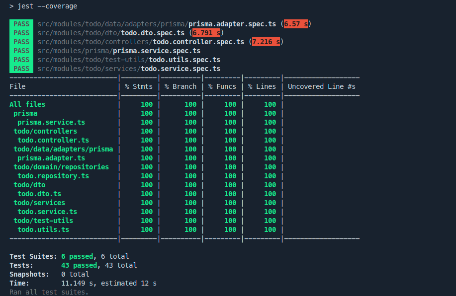
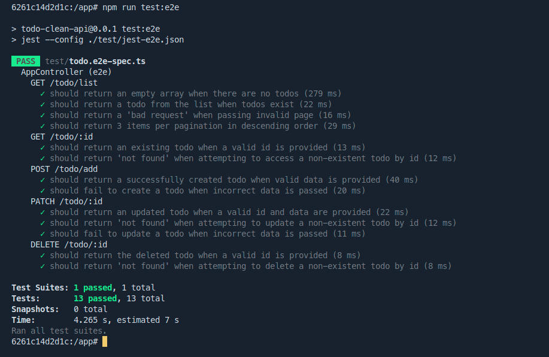

# Todo Clean API

## Running the containers

```bash
# start development
$ make dev.up

# stop development
$ make dev.down
```

## Access Containers

```bash
# Application
$ docker exec -it api sh

# PostgresSQL
$ docker exec -it db bash
```

## Running prisma migration 
```bash
$ npx prisma migrate dev
```

```bash
# development
$ npm run start

# watch mode
$ npm run start:dev

# production mode
$ npm run start:prod
```
## Test

```bash
# unit tests
$ npm run test

# e2e tests
$ npm run test:e2e

# test coverage
$ npm run test:cov
```


## Goals
  - Configuration
     - [x] Docker
     - [x] Prisma client
     - [x] Jest
     - [x] Global pipes
     - [x] Cors
     - [x] Swagger
  - Prisma Service
    - [x] Test prisma 
    - [x] Prisma service
  - Domain
    - [x] Entities
    - [x] Repository
  - DTO
    - [x] Test (Write todo & update todo)
    - [x] Write todo & update todo
  - Todo  
    - Data
      - [x] Test prisma adapter
      - [x] Prisma adapter
    - Services
      - [x] Test todo service
      - [x] Todo Service
    - Controllers
      - [x] Test todo controller
      - [x] todo controller
  - Tests
    - [x] Test e2e

## Application structure

- `src`

  - `main.ts`
    - nest.js bootstrap
  - `app.module.ts`
    - loads all modules
  - `modules`
    - `{name}`
      - `controllers`
        - `{name}.controller.spec.ts`
        - `{name}.controller.ts`
      - `services`
        - `{name}.service.spec.ts`
        - `{name}.service.ts`
      - `data`
        - `adapters`
          - `{name}`
            - `{name}.adapter.spec.ts`
            - `{name}.adapter.ts`
      - `domain`
        - `entities`
          - `{name}.ts`
        - `repository`
          - `{name}.ts`
      - `dto`
        - `{name}.dto.spec.ts`
        - `{name}.dto.ts`
      - `{name}.module.ts`

- `test`
  - `utils`
    - Utilities for application testing
  - `{name}.e2e-spec.ts`
    - Tests e2e

## App Routes

  - `/todo/list` (GET)
  - `/todo/:id` (GET)
  - `/todo/add` (POST)
  - `/todo/:id` (PATCH)
  - `/todo/:id` (DELETE)

## Tests Coverage




## Tests e2e



## Patterns

- (OOP) Object-Oriented Programming
- (TDD) Test-Driven Development
- (DDD) Domain-Driven Design
- (DI) Dependency Injection
- (DIP) Dependency Inversion Principle
- (DTO) Data Transfer Object
- (DP) Decorator Pattern